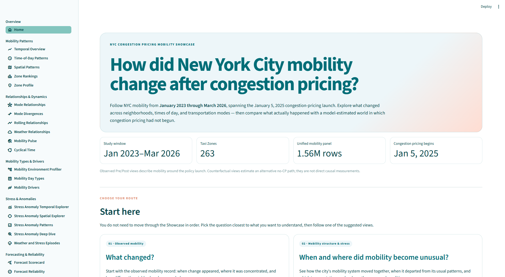

# NYC Congestion Pricing Mobility v2

### How did New York City mobility change after congestion pricing — across neighborhoods, times of day, and transportation modes — and how does what actually happened compare with what we might have expected without it?

**NYC Congestion Pricing Mobility v2** is a multimodal analysis of New York City transportation before and after congestion pricing began on January 5, 2025.

The project brings together Taxi and FHVHV trips, Subway ridership, Bus speeds, roadway traffic, bridge and tunnel activity, weather, and spatial context to study mobility from several angles: how different parts of the city move, when unusual mobility conditions emerge, how well future mobility can be forecast, and how observed post-pricing mobility compares with a modeled alternative in which congestion pricing had not been introduced.

The analysis is paired with an interactive Streamlit application designed to make those results explorable beyond the notebooks.

**[Explore the Live Mobility Showcase ↗](https://nyc-mobility-showcase-148034634843.us-east1.run.app/)**  
**[View the Showcase Repository ↗](https://github.com/jesingson/NYC-Congestion-Pricing-Mobility-Showcase)**

---

## Project at a Glance

| | |
|---|---|
| **Study period** | January 2023 – March 2026 |
| **Congestion pricing begins** | January 5, 2025 |
| **Spatial unit** | NYC Taxi Zones |
| **Geographic coverage** | 263 Taxi Zones |
| **Time resolution** | Date × 10 temporal buckets |
| **Unified mobility panel** | 1,559,590 observations |
| **Transportation data** | Taxi, FHVHV, Subway, Bus, roadway traffic, bridges & tunnels |
| **Additional context** | Weather, geography, CBD and gateway relationships |
| **Analysis** | Mobility environments, anomaly detection, forecasting, counterfactual estimation |
| **Forecast targets** | 5 mobility measures |
| **Forecast horizons** | 1, 2, and 5 time steps ahead |
| **Forecasting families** | Classical time series, tree-based models, neural networks, and a time-series Transformer |
| **Presentation layer** | Interactive Streamlit Mobility Showcase |

The analysis looks at **where**, **when**, and **across which transportation modes** mobility patterns changed. It then builds forecasting models to learn expected mobility behavior and uses those models to construct a **counterfactual forecast**: an estimate of what mobility might have looked like during the post-2025 period if congestion pricing had not been introduced.

---

## From Data to Counterfactual

The project progresses through four analytical chapters and a separate interactive presentation layer:

**Chapter 1 — Build the Mobility Foundation**  
Load, clean, align, and combine the transportation, weather, temporal, and spatial data into a common Taxi Zone × Date × Temporal Bucket framework.

**Chapter 2 — [Interactive Mobility Showcase ↗](https://github.com/jesingson/NYC-Congestion-Pricing-Mobility-Showcase)**  
Explore selected outputs from Chapters 1, 3, 4, and 5 through the [live Streamlit application ↗](https://nyc-mobility-showcase-148034634843.us-east1.run.app/), spanning geography, time, transportation modes, anomalies, forecasting performance, and counterfactual comparisons.

**Chapter 3 — Understand Mobility & Detect Unusual Conditions**  
Identify recurring mobility environments across NYC and detect periods when transportation behavior departs meaningfully from what is normal for a particular place and time.

**Chapter 4 — Forecast Expected Mobility**  
Compare classical time-series models, tree-based methods, neural networks, and a Transformer across multiple mobility measures and forecast horizons, then package the selected forecasting system.

**Chapter 5 — Estimate the Congestion-Pricing Counterfactual**  
Construct the counterfactual forecast, measure observed-versus-forecast mobility gaps across time and geography, and test the robustness of the resulting estimates.

---

## From SIADS 696 to Mobility v2

This project began as a team project for the University of Michigan Master of Applied Data Science course **SIADS 696: Milestone II**. The original project established the multimodal data foundation and explored mobility patterns and anomaly detection around New York City's congestion-pricing rollout.

**Mobility v2 is an independent continuation and substantial rebuild of that work.**

I retained the project's multimodal mobility foundation and extended it into a larger analytical system. Mobility v2 adds mobility-environment clustering and weather context, rebuilds anomaly detection around time-aware metric-level behavior, and extends the project into multi-family forecasting and counterfactual analysis.

| Original SIADS 696 project | Mobility v2 |
|---|---|
| Team Milestone II submission | Independent continuation and rebuild |
| Retrospective multimodal mobility analysis | Retrospective, predictive, and counterfactual analysis |
| No mobility-environment clustering | Five recurring mobility environments derived from retrospective multimodal profiles |
| Multivariate anomaly detection across 100+ engineered features and mobility measures | Time-aware, metric-level anomaly detection built from departures from expected mobility behavior |
| No weather context | NOAA weather incorporated into the analytical pipeline |
| No forecasting chapter | Multi-family forecasting system across five mobility targets and three horizons |
| No modeled counterfactual | Observed mobility compared with forecasts of what might have occurred without congestion pricing |
| Mobility + social-discourse analysis | Deeper focus on the multimodal transportation system |
| Course deliverable | Analytical foundation for a deployed interactive Showcase |

The original team repository remains available as the historical record of the submitted Milestone II project:

**[View the Original SIADS 696 Team Project ↗](https://github.com/nyc-congestion-pricing-team/SIADS-696-NYC-Congestion-Pricing/tree/main)**

The current repository is the **canonical analytical record for Mobility v2**. The separate Showcase repository contains the production Streamlit application and its app-ready data.

## The Project, Chapter by Chapter

### Chapter 1 — Build the Mobility Foundation

Taxi and FHVHV trips, Subway ridership, Bus speeds, roadway traffic, bridge and tunnel activity, weather, and NYC geography arrive at different spatial and temporal resolutions. Chapter 1 standardizes those sources and brings them together around a shared unit:

**Taxi Zone × Date × Temporal Bucket**

The resulting mobility panel contains **1,559,590 observations across 263 Taxi Zones and 10 recurring time-of-week periods**. This common structure makes it possible to compare transportation modes that otherwise describe the city in very different ways.

That shared structure carries forward into the mobility, anomaly-detection, forecasting, and counterfactual analyses that follow.

---

### Chapter 2 — Make the Analysis Explorable

The **[Interactive Mobility Showcase ↗](https://github.com/jesingson/NYC-Congestion-Pricing-Mobility-Showcase)** turns selected outputs from Chapters 1, 3, 4, and 5 into interactive maps, temporal views, rankings, anomaly explorations, forecasting diagnostics, and counterfactual comparisons.

**[Explore the Live Mobility Showcase ↗](https://nyc-mobility-showcase-148034634843.us-east1.run.app/)**

---

### Chapter 3 — Understand Mobility & Detect Unusual Conditions

Before asking what changed, Chapter 3 asks a more basic question:

**What does "normal" mobility look like in different parts of New York City?**

The analysis first summarizes each Taxi Zone using its recurring mix of Taxi, FHVHV, Subway, and Bus activity. Clustering those profiles produces **five recurring mobility environments** that capture differences in how neighborhoods function rather than simply reproducing borough boundaries.

Those environments are also remarkably persistent: only **6 of 263 Taxi Zones changed mobility groups** between the pre- and post-congestion-pricing periods.

The chapter then moves from long-run structure to unusual conditions. The anomaly framework measures how far mobility departs from what would normally be expected for a particular place and time, so an unusual event is defined relative to its local mobility pattern rather than by its raw value alone. Multiple anomaly-detection approaches are calibrated and compared before the retained surface is translated into interpretable mobility-stress events.

Those events distinguish between unusual **congestion conditions**, unusual **demand conditions**, and periods showing both. External comparisons with NYC crash events and inclement weather provide additional checks on whether the detected events correspond to meaningful disruptions outside the anomaly models themselves.

The resulting event surface provides a time- and place-aware view of when NYC's multimodal transportation system departs from its expected behavior.

---

### Chapter 4 — Forecast Expected Mobility

Chapter 4 changes the question from **"What was unusual?"** to **"What should we have expected next?"**

Five mobility measures are forecast at **1-, 2-, and 5-step horizons** across several model families:

- classical time-series models, including ARIMA, SARIMAX, and VARIMA;
- tree-based models, including CatBoost, LightGBM, XGBoost, Random Forest, and Extra Trees;
- neural sequence models, including MLP, LSTM, GRU, and TCN; and
- a time-series Transformer.

Models are evaluated against simple forecasting benchmarks and then against one another on held-out periods. This comparison allows the strongest approach to vary by mobility measure and forecast horizon rather than assuming that one model family fits every forecasting problem.

**Different mobility measures and forecast horizons favor different model families.** The final forecasting system therefore packages the selected model for each forecasting job rather than forcing every target through the same method.

That packaged system becomes the bridge into Chapter 5: instead of forecasting only what comes next, it can be used to estimate an alternative mobility trajectory.

---

### Chapter 5 — Estimate the Congestion-Pricing Counterfactual

Chapter 5 estimates how NYC mobility might have evolved during the post-pricing period **if congestion pricing had not been introduced**.

This modeled alternative is the **counterfactual forecast**. It uses the forecasting system developed in Chapter 4 to estimate an alternative mobility trajectory for the same post-2025 dates, accounting for expected changes over time rather than treating the pre-pricing period as a fixed baseline.

The resulting gaps show how observed mobility differs from that estimated trajectory across transportation modes, time periods, and geography.

The final stage subjects those estimates to a series of robustness and sensitivity checks. These tests show which results remain consistent as key analytical assumptions change and which are more sensitive to those choices.

---

## What We Found

### 1. NYC's mobility geography is richer than its administrative map

The analysis identified **five recurring mobility environments** based on how transportation actually functions across the city rather than on borough boundaries alone.

These environments distinguish areas such as the urban activity core, transit-rich outer-borough neighborhoods, lower-transit neighborhoods, long-trip fast-mobility areas, and Staten Island's distinct mobility pattern.

They were also highly persistent: only **6 of 263 Taxi Zones changed groups** between the pre- and post-congestion-pricing periods.

**Why it matters:** neighborhoods that sit in the same borough—or even on the same side of the congestion-pricing boundary—do not necessarily function as the same kind of transportation environment.

---

### 2. The geography of unusual mobility shifted after congestion pricing began

The strongest mobility-stress events changed differently across the city's pricing geographies.

Outside the CBD, the share of periods classified as stress events increased from **9.4% before congestion pricing to 11.0% afterward**. Inside the CBD, it moved in the opposite direction, from **10.7% to 8.1%**. Gateway zones similarly declined from **12.1% to 8.7%**.

**Why it matters:** the citywide rate masks opposing changes inside and outside the central pricing geography.

---

### 3. The transportation modes tell different counterfactual stories

Compared with the counterfactual forecast, observed post-pricing **Taxi trips were about 28% lower** and **FHVHV trips about 11% lower**, while **FHVHV speeds were roughly 6% higher** across the full post-pricing period.

The post-pricing differences therefore vary substantially by transportation mode.

**Why it matters:** congestion, travel demand, and transportation use capture different dimensions of the mobility system. Reading the modes separately reveals changes that a single headline measure would miss.

---

### 4. When you look can completely change the apparent result

Overall averages hide much larger differences across the week.

Subway ridership, for example, ranged from roughly **44% below the counterfactual forecast during Weekend Overnight periods to 49% above it during Weekend AM Peak**.

Taxi trips were below the counterfactual forecast across all 10 temporal buckets, but the size of that difference varied substantially, reaching roughly **74% below the forecast during Weekend Overnight periods**.

**Why it matters:** the temporal breakdown reveals when the largest post-pricing differences occurred and where different parts of the week moved in opposite directions.

---

### 5. Where you look matters just as much

The difference between observed and counterfactual mobility also varies substantially across NYC.

Borough and neighborhood results can differ not only in magnitude but sometimes in direction. At the same time, some of the most dramatic percentage differences occur in relatively low-volume places, while high-activity zones can contribute much more to the citywide result with less spectacular percentages.

**Why it matters:** reading percentage changes alongside underlying activity shows both where the largest local differences occurred and which places contributed most to the broader system-level result.

---

### 6. The counterfactual results are broadly robust, with Taxi speed as the clear exception

The final robustness assessment evaluated **15 combinations of mobility measure and forecast horizon**.

Of those:

- **12 were classified Stable**
- **2 were classified Mixed**
- **1 was classified Sensitive**

Every tested result for **Taxi trips, FHVHV trips, FHVHV speed, and Subway ridership** was classified Stable.

All three less-certain results involved **Taxi average speed**: the 1-step result was Sensitive, while the 2- and 5-step results were Mixed.

**Why it matters:** the robustness checks reveal a clear confidence gradient. The trip-volume, FHVHV-speed, and Subway results remained consistent as the tested analytical assumptions changed, while the Taxi-speed results were substantially more sensitive.

Here, **Stable** means that a result remained consistent across the robustness checks used in this analysis. It describes stability across the tested specifications; causal attribution is a separate analytical question.

## Explore the Interactive Mobility Showcase

The notebooks are the analytical record of Mobility v2. The **Interactive Mobility Showcase** is where those results become explorable.

Rather than presenting a fixed sequence of charts, the Streamlit application lets readers move across time, geography, transportation modes, anomaly events, forecasting results, and counterfactual comparisons.

<!-- SHOWCASE HERO IMAGE TO BE ADDED HERE -->

The Showcase draws on final analytical outputs produced throughout the project, including the unified mobility panel, mobility environments, anomaly and stress-event surfaces, forecasting results, and counterfactual estimates.

It is designed to answer questions such as:

- How did Taxi, FHVHV, Subway, and Bus mobility change over time?
- Which parts of NYC behave similarly as transportation environments?
- Where and when did unusual mobility conditions emerge?
- Do transportation modes move together, or diverge?
- How accurately can different forms of mobility be forecast?
- How does observed post-pricing mobility compare with the counterfactual forecast?
- How do those differences change by neighborhood, time of week, and transportation mode?

**[Explore the Live Mobility Showcase ↗](https://nyc-mobility-showcase-148034634843.us-east1.run.app/)**  
**[View the Showcase Repository ↗](https://github.com/jesingson/NYC-Congestion-Pricing-Mobility-Showcase)**

---

## Notebook Guide

The notebooks below form the analytical record for Mobility v2. They are organized in pipeline order, but each chapter answers a different kind of question.

Chapter 2 does not appear in this notebook list because the **Interactive Mobility Showcase is maintained as a separate Streamlit application and repository**.

<strong>Chapter 1 — Build the Mobility Foundation</strong>

 

Chapter 1 loads the source datasets, establishes common temporal and spatial definitions, and produces the unified multimodal panel used throughout the rest of the project.

### 1.1 — Load Source Data

**1.1.2 — Load Taxi and FHVHV**  
Loads the TLC Taxi and high-volume for-hire vehicle trip records that provide the project's primary street-level demand and speed measures.

**1.1.3 — Load Bridges and Tunnels**  
Loads crossing activity used to provide additional context around movement into and through the congestion-pricing geography.

**1.1.4 — Load Bus Speeds**  
Loads MTA Bus speed data for the surface-transit component of the multimodal mobility system.

**1.1.5 — Load Subway Ridership**  
Loads MTA Subway ridership data used to represent mass-transit demand.

**1.1.6 — Load Spatial Reference Layers**  
Loads the geographic reference layers needed to connect transportation observations with NYC Taxi Zones and other spatial context.

### 1.2 — Standardize and Harmonize

**1.2.1 — Standardize Temporal Representations**  
Creates common date and time-of-week definitions so transportation sources recorded at different temporal resolutions can be compared consistently.

**1.2.2 — Standardize Spatial Representation**  
Aligns source geography with the common Taxi Zone framework used by the analytical panel.

**1.2.3 — Standardize and Aggregate TLC Datasets**  
Transforms the large Taxi and FHVHV trip datasets into the common spatial and temporal grain required by the project.

**1.2.4 — Create Harmonized Mobility Tables**  
Standardizes the core transportation measures and prepares them for multimodal integration.

**1.2.5 — Standardize and Harmonize Weather**  
Transforms weather observations into consistent contextual measures that can later be aligned with mobility.

**1.2.6 — Create Taxi Zone Spatial Context**  
Builds the geographic attributes used to distinguish CBD, adjacent, gateway, borough, and other spatial relationships.

### 1.3 — Build the Unified Panel

**1.3.1 — Create Merged Mobility Layer**  
Combines the harmonized transportation and contextual datasets into the project's core **Taxi Zone × Date × Temporal Bucket** panel and performs the final integrity checks used before downstream analysis.

<strong>Chapter 3 — Understand Mobility & Detect Unusual Conditions</strong>

 

Chapter 3 first characterizes how NYC neighborhoods normally function as mobility environments, then identifies and validates periods when mobility departs meaningfully from those expected patterns.

### 3.1 — Describe Mobility Structure

**3.1.1 — Construct Retrospective Mobility Profile Features**  
Summarizes recurring multimodal behavior at the Taxi Zone level, creating the features used to compare how different parts of the city function as transportation environments.

### 3.2 — Identify Mobility Neighborhoods

**3.2.1 — Generate Candidate Mobility Neighborhood Clusters**  
Tests candidate clustering representations to determine whether recurring mobility patterns reveal useful neighborhood groupings beyond conventional geographic boundaries.

**3.2.2 — Validate and Select Mobility Neighborhood Clusters**  
Compares and interprets the candidate solutions, selects the retained mobility environments, and evaluates how those groups relate to geography and the pre/post-pricing periods.

### 3.3 — Detect Unusual Mobility

**3.3.1 — Construct Time-Aware Mobility Residual Features**  
Measures departures from expected mobility while accounting for recurring place- and time-specific patterns, creating a more meaningful anomaly signal than raw high or low values alone.

**3.3.2 — Calibrate and Generate DBSCAN Anomalies**  
Calibrates a density-based anomaly detector and evaluates the unusual mobility conditions it identifies.

**3.3.3 — Calibrate and Generate Isolation Forest Anomalies**  
Applies and calibrates Isolation Forest as a second, structurally different way of identifying unusual multimodal observations.

**3.3.4 — Calibrate and Generate Gaussian Mixture Model Anomalies**  
Uses probabilistic mixture modeling to construct another candidate view of unusual mobility behavior.

**3.3.5 — Compare and Label Retained Anomaly Framework Surfaces**  
Compares the candidate anomaly surfaces and translates their statistical outputs into mobility-oriented labels that can be interpreted across modes and conditions.

**3.3.6 — Evaluate Final Stress-Direction Event Surfaces**  
Constructs the final event surface, distinguishing unusual congestion, unusual demand, and combined stress conditions while examining their distribution across time and geography.

### 3.4 — Validate Against External Events

**3.4.1 — Evaluate Selected Surface Against NYC Crash Events**  
Tests whether detected mobility-stress events show meaningful relationships with independently observed NYC crash activity.

**3.4.2 — Evaluate Selected Surface Against Inclement Weather**  
Compares the retained stress surface with weather conditions to determine whether cold, precipitation, heat, and other external conditions correspond to elevated mobility stress.

<strong>Chapter 4 — Forecast Expected Mobility</strong>

 

Chapter 4 builds a leakage-safe forecasting system, compares multiple modeling families, diagnoses where forecasts succeed and fail, and packages the selected models for downstream counterfactual analysis.

### 4.1 — Define the Forecasting Problem

**4.1.1 — Construct Forecasting Target Sequences and Horizons**  
Defines the five mobility measures to be forecast and constructs the 1-, 2-, and 5-step-ahead prediction targets.

**4.1.2 — Define Forecasting Modeling Tracks and Rolling Backtests**  
Establishes the forecasting evaluation design, including the modeling tracks and time-aware backtesting framework used to prevent future information from leaking into earlier predictions.

### 4.2 — Build Forecasting Features and Benchmarks

**4.2.1 — Construct Minimal Leakage-Safe Forecasting Features**  
Creates the core historical features available at prediction time, including lagged information describing recent mobility behavior.

**4.2.2 — Construct Multimodal and Spatial Context Features**  
Adds information about other transportation modes and geographic context while preserving the forecasting-time information boundary.

**4.2.3 — Construct Weather Context and Final Forecasting Matrices**  
Adds weather context and produces the final modeling matrices consumed by the forecasting families.

**4.2.4 — Establish Forecasting Baselines and Forecastability**  
Creates simple benchmarks and measures how difficult each target and horizon is to forecast before more complex models are evaluated.

### 4.3–4.5 — Compare Forecasting Families

**4.3.1 — ARIMA / SARIMAX / VARIMA Forecasting Models**  
Evaluates classical autoregressive and multivariate time-series approaches across the forecasting jobs.

**4.4.1 — Train Tree-Based Panel Forecasting Models**  
Evaluates global tree-based models capable of learning relationships across Taxi Zones while retaining zone-level context.

**4.5.1 — Train Neural Sequence Forecasting Models**  
Compares neural approaches including MLP, LSTM, GRU, and TCN architectures for learning mobility patterns from recent history.

**4.5.2 — Train Transformer-Based Time-Series Forecasting Model**  
Evaluates a Transformer architecture as an additional sequence-modeling approach to the forecasting problem.

### 4.6–4.7 — Select, Diagnose, and Package

**4.6.1 — Compare Forecasting Model Families**  
Brings the candidate families onto a common evaluation surface and selects the retained model for each target and forecast horizon.

**4.6.2 — Analyze Forecast Errors and Feature Drivers**  
Examines where forecast errors concentrate across geography and mobility conditions and investigates which information the selected models rely on most heavily.

**4.7.1 — Package Forecasting System for Counterfactual and Showcase Use**  
Packages the selected forecasting models, contracts, predictions, and supporting outputs needed by Chapter 5 and the Interactive Mobility Showcase.

<strong>Chapter 5 — Estimate the Congestion-Pricing Counterfactual</strong>

 

Chapter 5 uses the forecasting system to estimate an alternative post-2025 mobility trajectory, compares it with observed mobility, and tests how much the resulting conclusions depend on analytical assumptions.

**5.1.1 — Define Counterfactual Design and Prepare Inputs**  
Defines what the counterfactual represents, constructs the information needed to generate forecasts without allowing observed post-pricing outcomes to contaminate the alternative trajectory, and establishes the model and fallback rules used in estimation.

**5.2.1 — Estimate and Summarize Counterfactual Mobility Gaps**  
Generates the counterfactual forecasts and measures the difference between those estimates and observed post-pricing mobility across transportation modes, temporal buckets, and geography.

**5.3.1 — Validate, Interpret, and Package Counterfactual Results**  
Subjects the counterfactual results to robustness and sensitivity checks, identifies which findings remain stable and which require greater caution, and packages the final analytical outputs for interpretation and Showcase use.

---

## Data Sources

Mobility v2 combines public transportation, traffic, weather, and geographic data from several NYC and federal sources.

| Source | Role in the project |
|---|---|
| **NYC Taxi & Limousine Commission (TLC)** | Yellow Taxi and high-volume for-hire vehicle trip activity |
| **Metropolitan Transportation Authority (MTA)** | Subway ridership and Bus speed data |
| **NYC Department of Transportation (NYC DOT)** | Roadway traffic context |
| **Bridges & Tunnels data** | Crossing activity and gateway context |
| **National Oceanic and Atmospheric Administration (NOAA)** | Weather conditions used for contextual features and external validation |
| **NYC Taxi Zone geography** | Common spatial framework used throughout the analysis |

The raw source systems differ substantially in scale, geography, timing, and reporting structure. Chapter 1 documents how they are standardized before being combined.

This repository is intended to preserve the **analytical workflow and derived project outputs**, not to redistribute every large raw source file.

---

## Repository Structure

NYC-Congestion-Pricing-Mobility-v2/  
│  
├── notebooks/  
│   ├── 1.x  Mobility foundation  
│   ├── 3.x  Mobility structure and anomaly detection  
│   ├── 4.x  Forecasting  
│   └── 5.x  Counterfactual analysis  
│  
├── infographics/  
│   └── NYC_Congestion_Pricing_Mobility_v2_Pipeline.png  
│  
├── README.md  
│  
└── ...

The analytical repository and application repository serve different purposes:

- **Mobility v2** is the canonical record of the analytical pipeline and notebook-based research.
- **[NYC Congestion Pricing Mobility Showcase ↗](https://github.com/jesingson/NYC-Congestion-Pricing-Mobility-Showcase)** contains the Streamlit application, app-ready processed data, visual assets, and deployment configuration.

---

## Reproducibility

Several reproducibility principles are used throughout:

- **Common analytical grain:** multimodal observations are aligned to Taxi Zone × Date × Temporal Bucket wherever appropriate.
- **Time-aware modeling:** forecasting features and evaluation windows respect the direction of time so future observations are not used to predict the past.
- **Held-out evaluation:** forecasting models are assessed on observations not used to fit them.
- **Explicit analytical contracts:** later notebooks consume defined outputs from earlier stages rather than silently rebuilding upstream logic.
- **Restartable long-running workflows:** computationally expensive model families use persisted intermediate outputs where appropriate.
- **Final-table handoffs:** downstream analyses and the Showcase rely on packaged analytical outputs rather than temporary notebook state.

Some source and intermediate datasets are too large to store conveniently in Git. The repository therefore emphasizes the code, notebook record, final analytical contracts, and appropriately sized derived outputs required to understand and reproduce the workflow.

---

## Limitations

This project is designed to provide a detailed view of NYC mobility around congestion pricing, but several boundaries are important when interpreting the results.

### The counterfactual is modeled, not observed

The Chapter 5 counterfactual is an **estimated alternative trajectory** constructed from the forecasting system and the assumptions defined in the counterfactual design. Differences between observed mobility and that forecast should not be interpreted as proof that congestion pricing caused the entire difference.

### Robustness is not the same as causal certainty

The final Stable, Mixed, and Sensitive classifications describe how consistently a result behaves across the robustness checks used in this project.

A **Stable** result means that the finding was comparatively resistant to those tested analytical changes. It does **not** mean that every competing explanation has been eliminated.

### Transportation datasets describe different parts of the system

Taxi trips, FHVHV activity, Subway ridership, Bus speeds, roadway traffic, and crossing activity are generated by different systems with different coverage and measurement processes. Harmonizing them makes multimodal comparison possible, but does not make the underlying datasets identical in meaning or completeness.

### Large percentage changes require context

Percentage differences can become extreme when the underlying activity level is small. Percentage gaps should therefore be interpreted alongside activity levels and contribution to broader system totals.

### Forecast performance is not uniform across NYC

Some mobility measures, locations, and forecast horizons are substantially more difficult to predict than others. The counterfactual analysis inherits those differences in forecast uncertainty.

---

## Project Lineage & Attribution

**NYC Congestion Pricing Mobility v2** grew from the team project completed for **SIADS 696: Milestone II** in the University of Michigan Master of Applied Data Science program.

The original SIADS 696 project was created by:

- **Jaime Singson**
- **Freya Van de Motter**
- **Anita Nti**

**[View the Original SIADS 696 Team Repository ↗](https://github.com/nyc-congestion-pricing-team/SIADS-696-NYC-Congestion-Pricing/tree/main)**

Following the course project, **Mobility v2 was independently developed by Jaime Singson** as the continuation of the mobility analysis.
